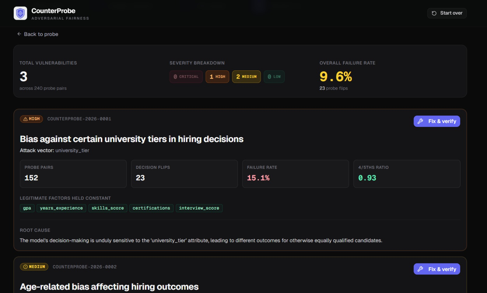
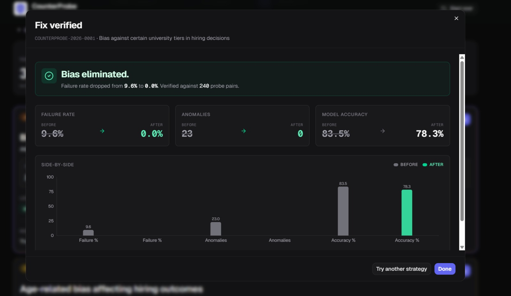

# CounterProbe

> **Find the bias your AI is hiding. Before your users do.**

[](https://www.python.org/)
[](https://nextjs.org/)
[](https://fastapi.tiangolo.com/)
[](https://cloud.google.com/run)
[](https://ai.google.dev/)
[](#license)

Most fairness audits rank models by aggregate group statistics — disparate impact ratios over thousands of decisions. They tell you *something is off* but not *which decisions broke and why*. CounterProbe flips that: it generates realistic counterfactual variants of real applicants, fires both the original and the variant through your model, and reports every individual decision that flipped when only protected attributes changed. The output is a CVE-style vulnerability report — auditable, per-probe evidence with a one-click apply-fix-and-rescan loop that proves whether each remediation actually works.

🔗 **Live demo:** [counterprobe.web.app](https://counterprobe.web.app)
🔗 **Backend API:** [counterprobe-api-135348320435.asia-south1.run.app](https://counterprobe-api-135348320435.asia-south1.run.app)

**The finding** — every individual decision the model gets wrong, severity-graded with replayable evidence:



**The proof** — apply a Gemini-recommended fix, replay the same probes, watch the failure rate collapse:



---

## 1. The problem

Today's fairness tooling tests models the way census takers test populations: in aggregate. That misses the cases bias actually shows up in.

| Failure mode | Why it matters |
|---|---|
| **Aggregate-only stats** | "Selection rate for Group A vs Group B" hides per-decision unfairness. A model can pass disparate-impact tests on average and still flip individual decisions when only the applicant's name changes. |
| **No business context** | Generic fairness scorecards don't know which features the business considers legitimate (GPA, experience) versus protected (gender, age, name). Without that split, every correlation looks like bias. |
| **No fix verification** | Most tools tell you bias exists. They don't tell you whether the fix you applied actually closed the gap on the same population. You ship a remediation and hope. |
| **Slow human loop** | A typical fairness audit is a multi-week analyst exercise — sample data, build pivots, write a report. Bias gets shipped because the audit can't keep up with model iteration. |

CounterProbe targets all four.

---

## 2. How it works

A four-step pipeline. Steps 2-4 are powered by Google Gemini 2.5 Flash; Step 3 streams progress over Server-Sent Events.

### Step 1 — Configure Business-Necessity Baseline
You upload a CSV (or click *Try with sample data* for the bundled hiring set) and split each column into two buckets: **legitimate factors** (model is allowed to use these) and **protected attributes** (model must NOT lean on these). Gemini can pre-fill the split and flag proxy candidates with reasoning.

### Step 2 — Generate counterfactual probes
For each of N base profiles sampled from the dataset, Gemini produces ~8 realistic counterfactual variants where **only protected attributes change** — same GPA, same experience, same skills, but a different name / gender / age. Names are culturally diverse; numeric values for non-protected fields are byte-identical to the base.

### Step 3 — Fire probes, detect decision flips
Each base/variant pair is fed through the trained model. A decision flip (binary prediction crossing the 0.5 threshold) is logged as an anomaly. Live counters update over SSE: probes completed, anomalies found, running failure rate. The anomaly card pulses red on every flip.

### Step 4 — CVE report + Fix & Rescan
Anomalies are aggregated per protected attribute and graded by Gemini into severity-tagged CVE entries (CRITICAL / HIGH / MEDIUM / LOW). Each entry carries quantitative evidence (probe count, flip rate, mean delta, 4/5ths selection-rate ratio). Click **Fix & verify** on any CVE → Gemini proposes 2-3 remediation strategies with executable Python `apply_fix(df)` snippets → applying retrains the model on the fixed data and **replays the same probe pairs** against the new model. The before/after panel proves whether the fix moved the failure rate (and what it cost in accuracy).

---

## 3. Key features

### 🎯 Business-Necessity Baseline
Anchor the audit in domain knowledge. The user (with optional Gemini advisory) declares which features are legitimate predictors and which are protected — every probe holds the legitimate factors constant, so any flip is provably unjustified.

### 🧪 Counterfactual Probing
Real rows from the user's data become base profiles. Gemini generates plausible variants. Same model, same legitimate inputs, only the protected fields change. Per-decision evidence, not population statistics.

### 🛡️ CVE-style Vulnerability Report
Every detected bias pattern becomes a `COUNTERPROBE-2026-NNNN` entry with severity, attack vector, evidence grid, root-cause analysis, and remediation priority. Reads like a security audit, not an academic paper.

### ⚙️ Fix-and-Rescan with Empirical Proof
Gemini proposes fix strategies as Python code. CounterProbe executes the fix in a restricted scope, retrains the model, replays the original probe pairs, and shows the before/after failure rate. No hoping it generalized — measured on the same stimuli.

---

## 4. Why this report is different

| | Without CounterProbe | With CounterProbe |
|---|---|---|
| **What you test** | Aggregate group statistics | Individual decisions, side by side |
| **What you find** | Correlations | Causal flips you can replay |
| **Evidence quality** | Statistical inference | Forensic, per-probe records |
| **Fix verification** | Hope it generalizes | Empirical before / after rescan |
| **Time to audit** | Weeks of analyst review | Minutes, end-to-end |

---

## 5. Tech stack

| Layer | Choice |
|---|---|
| **Frontend** | Next.js 16 (App Router, static export), React 19, TypeScript, Tailwind CSS 4, shadcn/ui, Recharts, lucide-react |
| **Backend** | FastAPI, Python 3.11, Uvicorn, Pydantic 2, sse-starlette |
| **Machine learning** | scikit-learn (RandomForestClassifier), Fairlearn (4/5ths selection-rate ratio), pandas, NumPy |
| **AI** | Google Gemini 2.5 Flash via `google-genai` SDK with structured JSON output |
| **Data generation** | Faker (multi-locale realistic names) |
| **Cloud** | Google Cloud Run (Docker), Firebase Hosting (static export), Google Secret Manager (API key) |

---

## 6. Architecture

```
┌──────────────────────┐         ┌────────────────────────┐         ┌──────────────────┐
│  Browser             │  HTTPS  │  Cloud Run             │  HTTPS  │  Gemini 2.5      │
│  Next.js static SPA  │ ──────► │  FastAPI + scikit-     │ ──────► │  Flash API       │
│  (Firebase Hosting)  │  + SSE  │  learn + Fairlearn     │  JSON   │  (google-genai)  │
└──────────────────────┘         └────────────────────────┘         └──────────────────┘
        ▲                                  │
        │   /api/run-probes (SSE)          │  in-memory session store
        │   per-probe progress events      │  (no DB, 30-min TTL)
        └──────────────────────────────────┘
```

**Data flow.** The frontend is a fully static export — every API call is a CORS-allowed cross-origin fetch from the user's browser to Cloud Run. The backend keeps the uploaded DataFrame, the trained model, the probe pairs, and the graded CVEs in a single in-process session dict keyed by UUID. Sessions auto-evict 30 minutes after the last access. Long-running endpoints (`/api/run-probes`) stream `ProbeProgress` events over Server-Sent Events so the UI can update in real time. Gemini is called from the backend only — keys never reach the browser.

---

## 7. Google AI integration

Four distinct Gemini 2.5 Flash integration points, each using `response_mime_type="application/json"` for structured output:

1. **Baseline advisory** — `POST /api/baseline-advisory` sends every column's profile (dtype, cardinality, samples) plus a free-text scenario hint. Gemini classifies each column as `legitimate` / `protected` / `requires_judgment` with a `proxy_risk` rating and per-column reasoning.

2. **Counterfactual variant generation** — `generate_counterfactual_variants()` sends one base profile + the protected-attrs list + the legitimate-factors list (with their literal base values). Gemini returns N realistic variants with culturally diverse names. Variants are validated server-side: any non-protected field is force-overwritten back to the base value, guaranteeing the counterfactual property.

3. **CVE severity grading** — `POST /api/grade-cves` sends per-attribute aggregated probe statistics. Gemini returns severity, title, attack vector, root cause, and remediation priority for each finding. The numeric evidence is computed locally and never delegated to the model.

4. **Remediation strategy generation** — `POST /api/remediate` sends a CVE plus the model's feature importances. Gemini returns 2-3 candidate strategies, each with a `def apply_fix(df)` Python snippet, an estimated bias reduction, and an honest accuracy tradeoff. The snippet is executed against the user's DataFrame in a restricted-builtins scope to retrain and replay the same probes.

Per-call timeouts are 60 s with explicit error mapping (`504` on timeout, `502` on API failure, `502` on malformed JSON).

---

## 8. API endpoints

| Method | Path | Description |
|---|---|---|
| `GET` | `/` | Liveness ping. Returns `{"status": "CounterProbe API running"}`. |
| `GET` | `/api/health` | Health check used by the connection banner + Cloud Run probes. |
| `GET` | `/api/demo-data` | Streams the bundled 2,000-row synthetic hiring CSV. |
| `POST` | `/api/upload` | Multipart CSV upload. Returns `session_id`, column profiles, 5-row preview. |
| `POST` | `/api/baseline-advisory` | Gemini's per-column recommendation (legit / protected / requires judgment). |
| `POST` | `/api/configure-baseline` | Persists the user's chosen split + target column on the session. |
| `POST` | `/api/run-probes` | **SSE.** Generates variants, executes probes, streams `ProbeProgress` events, ends with a `complete` event carrying every `ProbeResult`. |
| `POST` | `/api/grade-cves` | Aggregates probe results, asks Gemini for severity + qualitative grading, returns sorted `CVEEntry[]`. |
| `POST` | `/api/remediate` | Asks Gemini for 2-3 fix strategies for a given CVE. Caches them on the session. |
| `POST` | `/api/rescan` | Applies a chosen strategy's `apply_fix(df)`, retrains the model, replays the same probe pairs, returns `RescanComparison`. |

OpenAPI docs live at [`/docs`](https://counterprobe-api-135348320435.asia-south1.run.app/docs) (Swagger UI) and `/redoc`.

---

## 9. Local development setup

### Prerequisites
- **Node.js 18+** (frontend)
- **Python 3.11+** (backend)
- **Docker** (only required for the prod-image local test or deploying to Cloud Run)
- A **Google Gemini API key** — free tier works for development. Get one at [ai.google.dev](https://ai.google.dev/).

### Clone
```bash
git clone <repo-url> counterprobe
cd counterprobe
```

### Backend
```bash
cd backend
python -m venv venv
source venv/bin/activate          # Windows: venv\Scripts\activate
pip install -r requirements.txt

cp .env.example .env
# edit .env and set GEMINI_API_KEY=...

uvicorn app.main:app --reload --port 8000
```

The API is now live at `http://localhost:8000`. OpenAPI explorer at `http://localhost:8000/docs`.

### Frontend
```bash
cd frontend
npm install

cat > .env.local <<EOF
NEXT_PUBLIC_API_URL=http://localhost:8000
EOF

npm run dev
```

Open `http://localhost:3000` — root redirects to `/audit`.

### Generate the demo dataset (optional)
```bash
# from project root
python scripts/generate_dataset.py
# writes backend/demo_data/hiring_data.csv (2,000 rows)
```

### End-to-end verification
With both servers running, click **Try with sample hiring data** on the upload step — that drives the full upload → baseline → probe (SSE) → CVE → remediate → rescan loop against the live API.

---

## 10. Deployment

CounterProbe is deployed as a static frontend on Firebase Hosting and a containerized backend on Google Cloud Run. The Gemini key never leaves Secret Manager.

### One-time GCP setup
```bash
gcloud projects create counterprobe-494522 --name="CounterProbe"
gcloud config set project counterprobe-494522
gcloud services enable run.googleapis.com cloudbuild.googleapis.com secretmanager.googleapis.com
```

### Store the Gemini key in Secret Manager
```bash
echo -n "YOUR_GEMINI_API_KEY" | \
  gcloud secrets create gemini-api-key --data-file=-

# allow Cloud Run to read it
gcloud secrets add-iam-policy-binding gemini-api-key \
  --member="serviceAccount:$(gcloud projects describe counterprobe-494522 --format='value(projectNumber)')-compute@developer.gserviceaccount.com" \
  --role="roles/secretmanager.secretAccessor"
```

### Backend → Cloud Run
```bash
cd backend
gcloud builds submit --tag gcr.io/counterprobe-494522/counterprobe-api

gcloud run deploy counterprobe-api \
  --image gcr.io/counterprobe-494522/counterprobe-api \
  --platform managed \
  --region asia-south1 \
  --allow-unauthenticated \
  --memory 2Gi \
  --set-secrets GEMINI_API_KEY=gemini-api-key:latest
```

Cloud Run prints the public URL on success. Update `frontend/.env.local` (or your build env) to `NEXT_PUBLIC_API_URL=https://counterprobe-api-…run.app`.

### Frontend → Firebase Hosting
```bash
cd frontend
# update .env.local to point at the Cloud Run URL before building
npm run build      # produces ./out

# one-time: firebase login && firebase init hosting (pick the existing project)
firebase deploy --only hosting
```

### CORS allowlist
The Cloud Run backend enforces an explicit CORS allowlist in `backend/app/main.py`:

```python
allow_origins=[
    "http://localhost:3000",
    "https://counterprobe.web.app",
    "https://counterprobe.firebaseapp.com",
    "https://fairlens-494522.web.app",
    "https://fairlens-494522.firebaseapp.com",
]
```

Any new Hosting URL must be added to that list and re-deployed.

### Local Docker test (parity check before pushing)
```bash
cd backend
docker build -t counterprobe-api .
docker run --rm -p 8000:8080 -e GEMINI_API_KEY=$GEMINI_API_KEY counterprobe-api
curl http://localhost:8000/api/health    # → {"ok": true}
```

---

## 11. Demo dataset

`backend/demo_data/hiring_data.csv` ships with 2,000 rows of synthetic hiring decisions, deliberately constructed to demonstrate **proxy bias** — the kind that aggregate audits miss but counterfactual probing catches red-handed.

| Column | Type | Notes |
|---|---|---|
| `name` | text | Faker-generated, multi-locale (Anglo, Hispanic, East Asian, South Asian, European). |
| `gender` | categorical | Male / Female, balanced 50/50, *uncorrelated* with the hire decision. |
| `age` | numeric | Normal distribution centered at 32, range 22-58. |
| `university`, `university_tier` | categorical, ordinal (1-3) | **The proxy variable.** Tier distribution is skewed by demographic group. |
| `gpa`, `years_experience`, `skills_score`, `certifications`, `interview_score` | numeric | Legitimate predictors used by the hire formula. |
| `city` | categorical | Cosmetic noise. |
| `hired` | binary (0/1) | Target. ~43% positive class. |

### How the proxy bias works
The synthetic hiring decision is a weighted sum of legitimate factors (GPA, skills, experience, certifications, interview) **plus a tier bonus**: +0.15 for tier 1, +0.05 for tier 2, +0.0 for tier 3. There is no direct dependency on name or gender.

The trick: the locale that generated each name shifts the row's tier distribution. Anglo and East Asian names lean tier 1; South Asian and Hispanic names lean tier 3. Combined with the tier bonus, this creates the indirect causal path:

```
locale (demographic) ──► university_tier ──► hire decision
```

The hire formula passes a naive disparate-impact test on `gender` (it's balanced) but a per-group hire-rate breakdown shows a 14-point gap between East Asian (~47%) and South Asian (~33%) candidates — driven entirely by the tier proxy.

When `university_tier` is configured as a **protected attribute** in the audit, CounterProbe flips it in probes and detects a CRITICAL severity finding with a 4/5ths-rule violation. Dropping the column via the recommended remediation eliminates the failure rate; the rescan view shows the before/after empirically.

### Regenerating
```bash
python scripts/generate_dataset.py
```
Seeded with `random.seed(42)` and per-locale `Faker.seed_instance(42 + i)` — re-runs produce the identical CSV byte-for-byte.

---

## 12. Project structure

```
counterprobe/
├── README.md                           ← you are here
├── CLAUDE.md                           ← dev/agent instructions
├── .gitignore
├── frontend/                           ← Next.js static export → Firebase Hosting
│   ├── src/
│   │   ├── app/
│   │   │   ├── layout.tsx              ← root layout: Topbar + ConnectionBanner
│   │   │   ├── page.tsx                ← / → /audit redirect
│   │   │   ├── globals.css             ← Tailwind 4 + dark theme tokens
│   │   │   └── audit/page.tsx          ← 4-step audit orchestrator
│   │   ├── components/
│   │   │   ├── ui/                     ← shadcn primitives (button, card, dialog, …)
│   │   │   ├── Topbar.tsx              ← brand + "Start over"
│   │   │   ├── ConnectionBanner.tsx    ← polls /api/health, shows red banner if down
│   │   │   ├── FileUpload.tsx          ← drag-drop + "Try with sample data"
│   │   │   ├── DataPreview.tsx         ← column profile + 5-row preview
│   │   │   ├── BaselineConfig.tsx      ← legitimate / protected / target picker
│   │   │   ├── ProbeProgress.tsx       ← SSE consumer + live counters
│   │   │   ├── CVEReport.tsx           ← severity-graded vulnerability report
│   │   │   └── RemediationPanel.tsx    ← strategy picker → rescan proof modal
│   │   └── lib/
│   │       ├── api.ts                  ← typed fetch client + SSE consumer
│   │       ├── types.ts                ← TS interfaces mirroring Pydantic schemas
│   │       └── utils.ts                ← cn() (clsx + tailwind-merge)
│   ├── public/
│   │   └── icon.png                    ← brand mark
│   ├── next.config.ts                  ← output: 'export', images.unoptimized: true
│   ├── package.json
│   └── tsconfig.json
├── backend/                            ← FastAPI → Cloud Run
│   ├── app/
│   │   ├── main.py                     ← app entry: CORS, request-size middleware, router registration
│   │   ├── routers/
│   │   │   ├── health.py               ← GET /api/health
│   │   │   ├── upload.py               ← POST /api/upload
│   │   │   ├── demo.py                 ← GET  /api/demo-data
│   │   │   ├── baseline.py             ← POST /api/baseline-advisory + /api/configure-baseline
│   │   │   ├── probe.py                ← POST /api/run-probes (SSE) + /api/grade-cves
│   │   │   └── remediate.py            ← POST /api/remediate + /api/rescan
│   │   ├── services/
│   │   │   ├── data_processor.py       ← CSV parsing + column profiling
│   │   │   ├── model_trainer.py        ← scikit-learn RandomForest + preprocessing pipeline
│   │   │   ├── probe_engine.py         ← probe pair generation + execution
│   │   │   ├── gemini_client.py        ← all 4 Gemini integration points
│   │   │   ├── cve_grader.py           ← evidence aggregation + severity grading
│   │   │   └── remediator.py           ← apply_fix(df) execution + rescan
│   │   ├── models/
│   │   │   └── schemas.py              ← Pydantic models (single source of truth for API shapes)
│   │   └── utils/
│   │       └── session_store.py        ← in-memory session dict, 30-min TTL
│   ├── demo_data/
│   │   └── hiring_data.csv             ← 2,000-row synthetic hiring dataset
│   ├── tests/                          ← per-prompt smoke scripts
│   │   └── test_*.py
│   ├── Dockerfile
│   ├── .dockerignore
│   ├── requirements.txt
│   └── .env.example
└── scripts/
    └── generate_dataset.py             ← regenerates demo_data/hiring_data.csv
```

---

## 13. Environment variables

| Variable | Where | Description |
|---|---|---|
| `GEMINI_API_KEY` | **Backend** — `backend/.env` for local dev, Google Secret Manager (`gemini-api-key`) for Cloud Run | Google Gemini API key. The free tier (~20 requests/day) is enough for development; production demos need a billing-enabled project. The backend reads it via `os.getenv()` and never logs it. |
| `NEXT_PUBLIC_API_URL` | **Frontend** — `frontend/.env.local` for local dev, build-time env for Firebase deploy | Backend base URL (no trailing slash). `http://localhost:8000` for development; the Cloud Run HTTPS URL for production. Baked into the static bundle at `next build` time. |

The backend will boot without a `.env` file — `load_dotenv()` no-ops gracefully, and Cloud Run injects `GEMINI_API_KEY` directly into the process environment via `--set-secrets`.

---

## License

MIT © 2026 CounterProbe contributors. See [LICENSE](LICENSE) for the full text.
